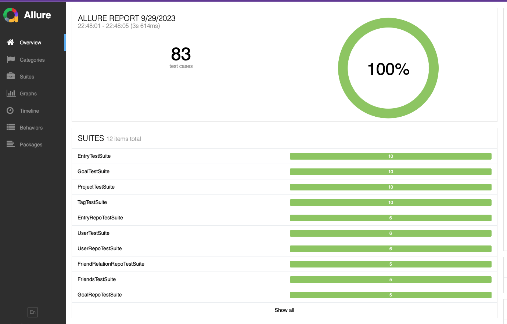

# Тестирование

## Тесты доступа к данным
Находятся в `src/internal/*/repository/postgres/`

## Тесты бизнес логики
Находятся в `src/internal/*/usecase/`

## Data builder patter
Все билдеры находятся в `src/internal/testutils/`

## Object mother
Не стал использовать этот паттерн, Data Builder показался мне более интересным, по крайней мере в Golang. Но есть небольшой пример:
`src/internal/testutils/tag_object_mother.go`


## Allure report
В гошке нет стандартной либы, использовал `allure-go` от `Ozon`

Запуск:
```bash
make test-allure

#в случайно порядке
make test-allure-shuffle
```
deps:
- allure

