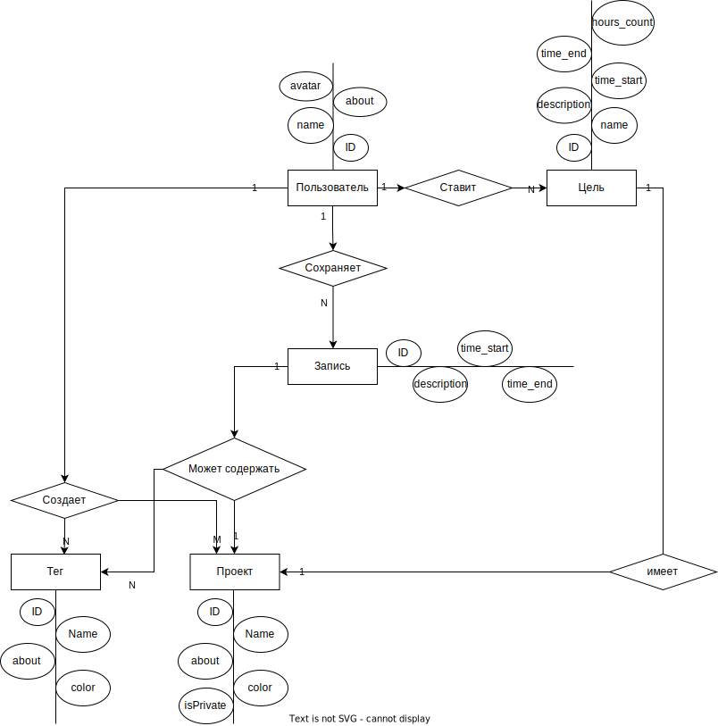

# PPO. Pet-project

## 1. Название проекта
Приложение для трекинга времени.

## 2. Краткое описание идеи проекта
Приложение позволяет отслеживать потраченное время, путем записей временных промежутков далее называемых записями. Запись может принадлежать проекту(проекты создает пользователь), так же запись может обладать тегом. 

В приложении можно смотреть статистику, например, что на лабораторные работы пользователь тратит N часов в неделю/месяц и так далее. Постановка целей, можно поставить себе цель на определенный срок, что за этот период нужно потратить столько-то часов на определенный проект.

К тому же в приложении можно добавлять других пользователей в друзья, если человек у вас в друзьях, вы можете посмотреть на что и сколько времени он тратит(для конфеденциальности проекты можно сделать приватными, чтобы не все проекты отображались всем твоим друзьям).

## 3. Краткое описание предметной области
Идею можно отнести к предметной области тайм-менеджмента и личной эффективности.

## 4. Краткий анализ аналогичных решений по 3 критериям
|  Критерий \ Решение |  Toggle  | RescueTime  | Motivate Clock |   Проект |
|---|---|---|---|---|
| Замер времени  | + | + | + | + |
| Доступно в РФ  | + | - | + | + |
|  Возможность добавлять друзей | - | - | - | + |
|  Возможность создавать проекты | + | + | + | + |

## 5. Краткое обоснование целесообразности и актуальности проекта (1 абзац)
В наше время все больше людей работают удаленно и не замечают, сколько времени они тратят на многие вещи. Поэтому важно дать пользователям простое приложение, позволяющее вести записи потраченного времени, чтобы можно было анализировать свою деятельность и эффективнее пользоваться таким важным ресурсом как время.

В текущей ситуации, в силу санкций, многие зарубежные сервисы были либо заблокированы, либо нет возможности их оплатить.

Таким образом, исходя из вышеприведенного сравнения имеющихся решений и изложенного рассуждения, предложенное решение является актуальным.

## 6. Use-Case - диаграмма

## 7. ER-диаграмма сущностей

## 8. Пользовательские сценарии
Неавторизованный пользователь:
   - Зарегистрироваться: ввести логин и пароль

Авторизованный пользователь:
- создать проект
- создать тег
- создать запись
- добавить проект к записи
- добавить тег к записи
- отредактировать запись
- посмотреть статистику за определенный период
- добавить человека в друзья
- посмотреть статистику друга за определенный период

## 9. Формализация бизнес-правил (BPMN)

## 10. Архитектурные характеристики, важные для проекта
- Тип приложения - Web API.
- Технологический стек: Golang, PostgreSQL, Docker.

## 11. Верхнеуровневое разбиение на компоненты
Приложение построено на основе Clean architecture, что предполагает разделение приложения на три слоя:

- Repository - взаимодействие с данными(хранение, создание, получение,- изменение);
- Usecase - бизнес логика;
- Delivery - обработка запросов, отправка ответов.

## 12. UML диаграммы классов

