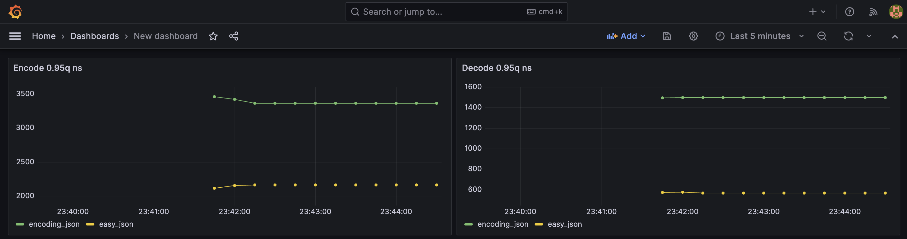

# Локальный запуск встроенной утилитой go test (без сервера)
```bash
❯ go test -v -benchtime=100000x
=== RUN   TestEncodeDecode
Encode result:
encoding/json.Marshall -- runs 100000 times	CPU:  2479 ns/op	RAM:    12 allocs/op  1321 bytes/op
easy-json.Marshall     -- runs 100000 times	CPU:  1416 ns/op	RAM:    12 allocs/op  1224 bytes/op

Decode result:
encoding/json.Unmarshall -- runs 100000 times	CPU:  2168 ns/op	RAM:     9 allocs/op   392 bytes/op
easy-json.Unmarshall     -- runs 100000 times	CPU:  1172 ns/op	RAM:     5 allocs/op   112 bytes/op
```


# Запуск сервера, у которого торчат ручки для запуска бенчмарка, данные собираются в prometheus
```bash
docker compose up -d benchmark # из папки src 
```

Можем запускать сколько угодно раз и хранить данные.
Основные используемые метрики (храним в prometheus): 
`encode_duration_ms`
`decode_duration_ms`.

Метрики по CPU и RAM были показаны в пункте с локальным запуском, они возвращаются в теле ответа на вызов ручки.

Примеры запуска:
```bash
docker compose up -d

## Вызов ручек бенчмарка
## encode
❯ curl -X POST http://localhost:8081/bench/encode\?n=100000
"encoding/json.Marshall -- runs 100000 times\tCPU: 10879 ns/op\tRAM:    40 allocs/op  4323 bytes/op",
"go-json.Marshall       -- runs 100000 times\tCPU:  8092 ns/op\tRAM:    40 allocs/op  4323 bytes/op"

# decode
❯ curl -X POST http://localhost:8081/bench/decode\?n=100000
"encoding/json.Unmarshall -- runs 100000 times\tCPU: 16766 ns/op\tRAM:   100 allocs/op  4240 bytes/op"
"easy-json.Unmarshall     -- runs 100000 times\tCPU:  6797 ns/op\tRAM:    60 allocs/op  3521 bytes/op"
```


## Grafana метрики
[http://localhost:3000/]


## Вывод
Можно сделать вывод, что easy-json работает в 2.5 быстрее при decode, нежели стандартная библиотека. И в 1.5 раза быстрее при encode. Из предположений это просиходит засчет меньшего количество аллокаций на операцию `allocs/op ` и меньшего времени CPU, затраченное на каждую операцию `ns/op`.


